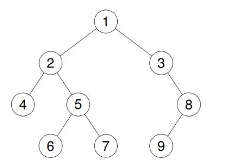

# Lecture 21 --- Trees, Part IV

Review from Lecture 20
- Breadth-first and depth-first tree search
- Increement/decrement operator
- Tree height, longest-shortest paths, breadth-first search
- Last piece of ds_set: removing an item, erase
- Erase with parent pointers, increment operation on iterators
- Limitations of our ds set implementatioN

## Today’s Lecture

- Morris Traversal

## 21.1 Morris Traversal

Morris Traversal is a tree traversal algorithm that allows inorder (and also preorder) traversal of a binary tree without using recursion or a stack, achieving O(1) space complexity. It modifies the tree temporarily but restores it afterward.

Instead of using extra memory (like recursion stack or an explicit stack), Morris Traversal utilizes threaded binary trees by:

- Finding the inorder predecessor of the current node.

- Temporarily modifying the tree structure by creating threads (links) to the current node.

- Using these links to traverse back instead of a recursive call.

## 21.2 Morris Traversal - In Order

- Start from the root.

- If the left subtree is NULL, print the node and move to the right.

- If the left subtree exists, find the inorder predecessor (rightmost node in the left subtree):

- If the predecessor’s right child is NULL, set it to the current node (threading) and move left.

- If the predecessor’s right child points to the current node (thread already exists), remove the thread, print the current node, and move right.

- Repeat until you traverse the entire tree.

```cpp
void inorderTraversal(TreeNode* root) {
        TreeNode *current=root;
        TreeNode *rightmost;
        while(current!=NULL){
            if(current->left!=NULL){
                rightmost=current->left;
                while(rightmost->right!=NULL && rightmost->right!=current){
                    rightmost=rightmost->right;
                }
                if(rightmost->right==NULL){ /* first time */
                    rightmost->right=current;
                    current=current->left;
                }else{  /* second time */
                    std::cout << current->val << " ";
                    rightmost->right=NULL;
                    current=current->right;
                }
            }else{  /* nodes which do not have left child */
                std::cout << current->val << " ";
                current=current->right;
            }
    }
    return;
}
```

You can test the above function using this program: [inorder_main.cpp](inorder_main.cpp).

For this test case,



The testing program prints:

```console
$ g++ inorder_main.cpp
$ ./a.out
Inorder Traversal using Morris Traversal:
4 2 6 5 7 1 3 9 8
```

## 21.3 Morris Traversal - Pre Order

```cpp
void preorderTraversal(TreeNode* root) {
      TreeNode *current=root;
      TreeNode *rightmost;
      while(current != nullptr){
        if(current->left != nullptr){
            rightmost=current->left;
            while(rightmost->right!=nullptr && rightmost->right!=current){
                rightmost=rightmost->right;
            }
            if(rightmost->right==nullptr){ /* first time */
                std::cout << current->val << " ";
                rightmost->right=current;
                current=current->left;
            }else{  /* second time */
                rightmost->right=nullptr;
                current=current->right;
            }
        }else{  /* nodes which do not have left child */
            std::cout << current->val << " ";
            current=current->right;
        }
    }
    return;
}
```

You can test the above function using this program: [inorder_main.cpp](inorder_main.cpp).

For above test case, the testing program prints:

```console
$ g++ preorder_main.cpp
$ ./a.out
Preorder Traversal using Morris Traversal:
1 2 4 5 6 7 3 8 9
```

## 21.4 Morris Traversal - Post Order

```cpp
```
